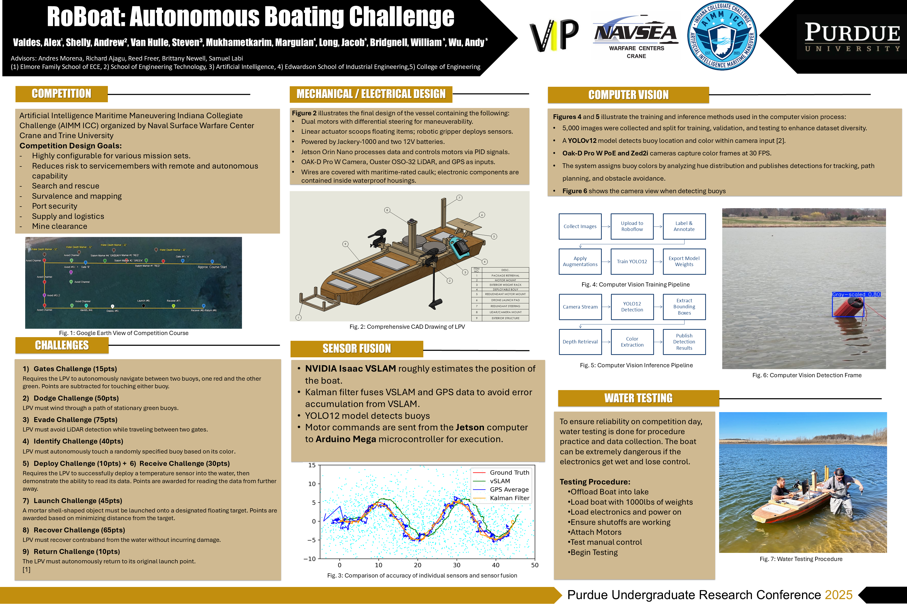

# Final Project
**Reverse Engineering a Device of Your Choosing**

Ben Manning, Purdue University

Alex Valdes, Purdue University

Last Modified: 2026-03-29

# Introduction

Approaching the end of the reverse engineering course, we have explored a lot of different devices and appliances, many of which you use personally on a regular basis even without realizing it. While it can be difficult to explore some proprietary devices, you can take the past knowledge you have developed, and get a general understanding on what is happening functionally in the vast majority of systems. The final project encompasses this notion by exploring essentially any device you would like.

# The Project
Your task for this project is to reverse engineer and document a device of your choosing, preferably a device that you use fairly regularly. THere are veyr few limitaitons on what you can explore in this project, but ehre are a few expectations of the device which are listed below. 

The device should have at least 3 of the listed functions below:
- Battery powered
- USB or other computer connection
- Capacitive buttons (they do not "press down" or "click")
- A screen or digital display
- Motor/PWM device operation
- Connects to the internet/Bluetooth (a "Smart" device)
- Has a camera
- Sensor input/environmental monitoring
- Speaker output
- Active cooling of a device
- Clock

Due to safety reasons, devices with the below operations/components will not be permitted to be explored for this project:
- High voltage operations (if operation voltage exceeds 120VAC (Wall outlet voltage) or 24VDC). This includes:
    - Magnetrons (microwaves)
    - CRT (Cathode Ray Tube displays) devices
    - Gas lasers
- Other laser devices exceeding 200mW (No burning or etching laswers) Only small diode lasers will be allowed (such as IR laser for line-of-sight control)
- Heating devices exceeding 100&deg;C (boiling point of water)(No 3D printers, or at least not using the extruder. Other CNC machiens are okay (that are NOT mentioned below))
- High torque/high RPM motors (such as electric yard tools, lathes, routers...)
- Rotating/oscillating blades (saws and other powered cutting tools)
If you are interested in dissecting a devcie, but are unsure if it meets the above requirements, or may fall into the un-permitted areas, please discuss with the instructor first. 
## Deliverables
There will be two main deliverables for this project that will focus on two forms of technical communication: a technical report in the form of a data sheet and a technical presentation.
### Datasheet (7.5% of final grade)
This document should read as if you are reading a datasheet of an IC or other technical manual of an appliance or component.  This document should be 3-5 pages (single spaced, 12pt font) and have the below information:
- Summary/general overview. This should include what the appliance is and its general use case.
- Pictures of critical parts of the appliance, both electrical and mechanical.
- List of mechanical components and their purpose in the device.
- List of electrical components with a description of the component and their purpose in the device.  Links to datasheets for sensors and chips should be included.
- Reverse Engineered Schematic with breakouts and descriptions for sub-circuits.  There should also be discussion about the sensors used in the system and how they impact the system.

This document should primarily be comprised of full sentences, tables, and charts, and should be able to be read by someone with limited electronics experience.

### Technical Poster (10\% of final grade)
You are also tasked with presenting your project to the other students in ECE39595, and answer questions regarding your reverse engineering process and product. This presentation will be in the version of a poster session where you will discuss your work more personally to a few people at a time.  A general discussion about your device should last around 5 minutes, and should not exceed 10 minutes.

- Summary/general overview. This should include what the appliance is and its general use case.
- Pictures and discussion of critical parts of the appliance, both electrical and mechanical.
- Reverse Engineered Schematic with breakouts and discussions for sub-circuits.  There should also be discussion about the sensors used in the system and how they impact the system.
- For parts that are too small to trace or blocked from view, develop a functional block diagram to represent the sub-processes.

This poster should not be a regurgitation of the technical report, but instead highlighting the really important parts of the report.  Images, tables, and schematics will likely be similar if not identical, but the way you discuss the information should be more personable.

Making an academic poster may be new to you, if so, you should utilize the poster templates linked below, they are PowerPoint based and are easy to work with. 

[Purdue Templates](https://marcom.purdue.edu/toolbox/templates/all-templates/?media=ms-office&_ga=2.65658281.649944167.1774805659-1489955093.1768082499)

#### Example Posters

If you have any questions on poster design, some resources are available through [Purdue OWL](https://owl.purdue.edu/owl/general_writing/common_writing_assignments/research_posters/research_poster_overview%20.html) or [Purdue Libraries](https://guides.lib.purdue.edu/posters).
### About the Deliverables
Taking a look at the rubrics below will show that the content asked for in each deliverable is very similar, which is true.  In fact, the first five categories of the rubrics are nearly identical except for the grade weights.  The main difference between the deliverables will be how the content is presented.  The datasheet should focus on the in-depth technical information, whereas the poster should be more of an overview of the technical data with room for discussion and questions.  While the formatting of the datasheet will likely look fairly similar between student submissions, the poster can, and should be unique to the presenter, their preferred presenting style, and should allow for the presenter's enthusiasm to be present and engaging.

# Datasheet Rubric
 | **Category** | **Exceeds Expectations**| **Meets Expectations** | **Approaching Expectations** | **Not Meeting Expectations**|
|:---|:---|:---|:---|:---|
|**Introduction (10 pts)**|Provides an in-depth, engaging overview of the appliance, its significance, and objectives, demonstrating exceptional clarity.|   Clearly describes the appliance, provides context, states objective, and defines scope.| Missing one or two elements, or descriptions are vague.| Lacks description, context, objective, or scope.|
|**Methodology (20 pts)** | Exceptionally detailed and well-justified methodology, including advanced considerations.| Detailed explanation, lists tools, step-by-step procedures, and justifies each step. |Some steps are unclear or missing, minimal |   No clear methodology, missing key steps.|
| **Analysis & Findings (30 pts)**|Provides an outstanding analysis with deep insights, comprehensive diagrams, and professional presentation.| Identifies components accurately, includes diagrams/photos, detailed circuit analysis, explains functionality, and addresses challenges.|   Some missing components or unclear explanations, diagrams lack clarity, minimal discussion of challenges.|   No significant findings, missing diagrams, or little analysis.|
|**Schematics & Diagrams (15 pts)**|      Exceptional, highly detailed schematics with professional clarity and layout.| Clear, labeled schematics supporting analysis. |  Some labeling errors or diagrams are unclear.|  Poorly labeled or missing schematics.|
|**Discussion (15 pts)** |  Provides deep insights and innovative suggestions with thorough comparisons and applications.| Interprets results, compares expected vs. actual functionality, suggests improvements and applications.| Lacks depth in comparison, minimal improvement suggestions. | No clear interpretation, lacks comparisons or insights.|
|**Conclusion (5 pts)** | Summarizes findings with exceptional clarity and depth, providing forward-thinking reflections.| Summarizes key findings and reflections.| Brief summary with minimal reflection.| No meaningful summary.|
 | **Presentation & Formatting (5 pts)**|   Exceptionally well-structured, polished, and highly professional writing.|Well-organized, free of grammar/spelling errors, professional writing. |    Some organization/grammar issues, but still understandable. | Poorly structured, many errors.|
  |**References & Citations (5 pts)**| High-quality sources, consistent format (IEEE, APA).|      Some citation errors or weak |No citations or improper formatting.|

# Presentation Rubric

 | **Category** | **Exceeds Expectations**| **Meets Expectations** | **Approaching Expectations** | **Not Meeting Expectations**|
|:---|:---|:---|:---|:---|
|**Introduction (5 pts)**|Provides a compelling and well-contextualized introduction, engaging the audience. | Briefly discusses the appliance, its use, and selection reasoning.|  Missing one element or lacks depth.| No introduction or vague explanation.|
| **Methodology (10 pts)** | Demonstrates an advanced understanding with highly detailed reverse engineering methods.| Explains reverse engineering approach, steps taken, and errors encountered. | Some missing details or unclear steps. | No clear methodology or missing major steps.|
|**Analysis & Findings (10 pts)**| Presents findings in an exceptionally clear, insightful, and well-organized manner. | Identifies components, organizes discussion, provides insights, and discusses challenges.| Some missing insights, vague organization. |  No clear findings, lacks discussion.|
|**Schematics & Diagrams (10 pts)**|Exceptionally well-labeled and structured diagrams, with innovative visualization techniques. | Clear, well-labeled diagrams with appropriate breakdown for readability.|  Some labeling issues or unclear schematics.| Poorly presented, missing schematics.|
|**Discussion (25 pts)**| Provides advanced insights, innovative comparisons, and actionable recommendations. | Interprets results, compares expected vs. actual, suggests improvements, and considers applications.  | Lacks depth or some missing elements.| No meaningful discussion or comparison.|
|**Presentation (25 pts)** | Exceptionally engaging, well-structured, confident, and professionally delivered. | Engaging, confident, well-structured slides, speaks clearly, answers questions professionally.| Some hesitation, minor slide issues, difficulty answering questions.|Poor organization, lacks confidence, difficult to follow.|
|**Asks Effective Questions (15 pts)**|   Asks insightful, thought-provoking questions that drive deeper discussions. | Asks 3 high-quality questions that further discussion.  | Asks some questions, but they lack depth. |  No meaningful questions or asks surface-level ones.|